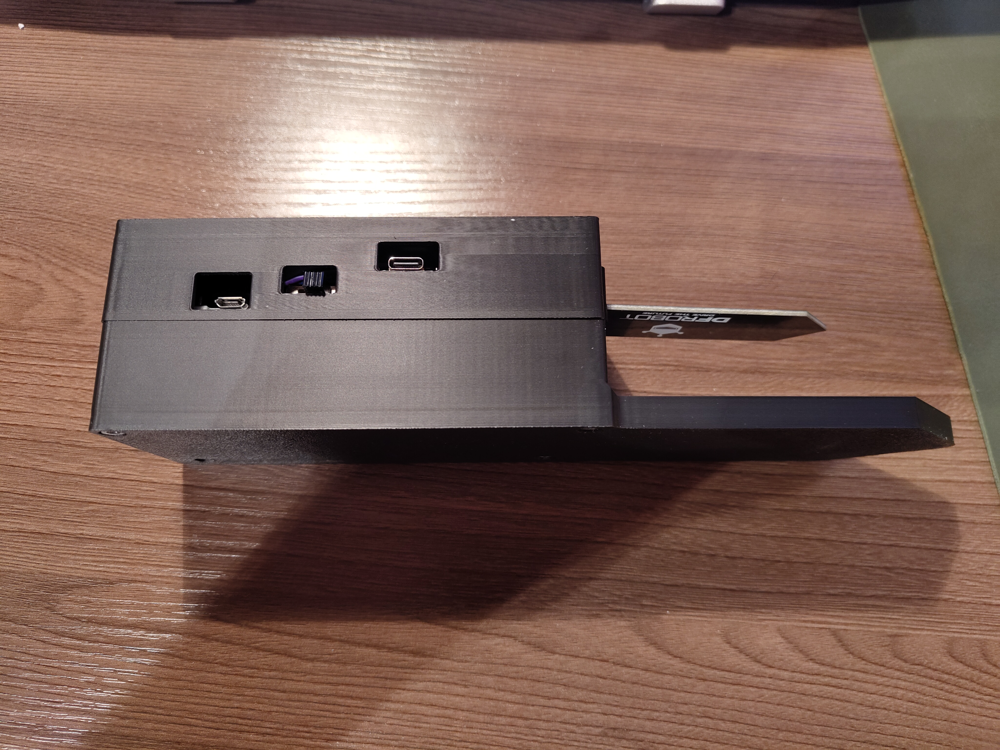
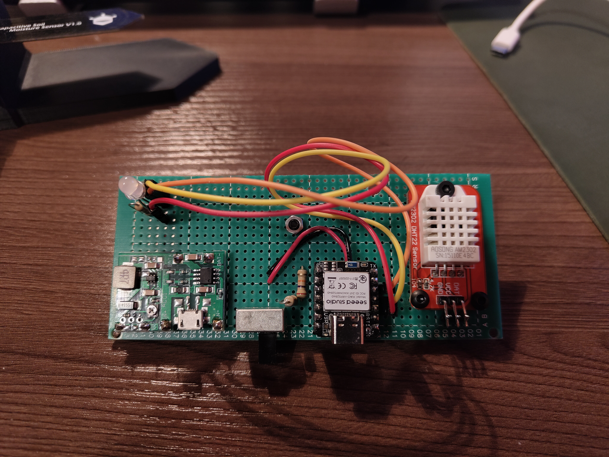

# Smart Monitoring System for Vertical Farming
 NRF52840 + BLE + ESP32 + LVGL + OV5640 + AI + AWSIOT

This is my final sem capstone project and still is a work in progress....

Soil Moisture Sensor

Temperature Sensor Without Casing

